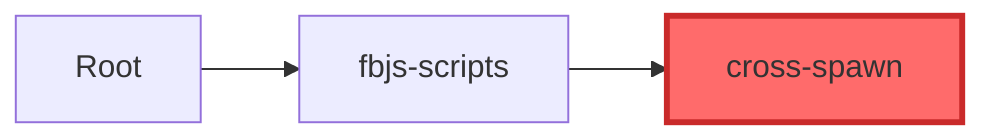
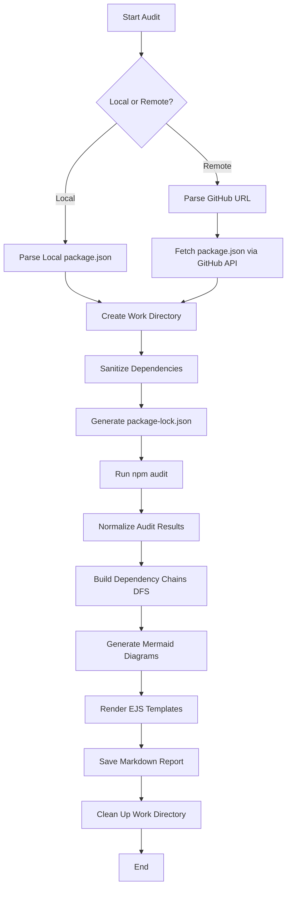

# AI Security Check (AISC)

[](https://opensource.org/licenses/MIT)
[](https://nodejs.org/)
[](https://modelcontextprotocol.io/)

> Enterprise-grade security dependency audit tool built on MCP Server protocol for seamless LLM integration

## 📋 Overview

AI Security Check (AISC) is a powerful security audit tool that addresses critical limitations in `npm audit`. Built on the Model Context Protocol (MCP), it provides comprehensive vulnerability analysis for both local projects and remote repositories, with seamless integration into LLM workflows (Cursor, LangChain, Dify).

### Key Features

- 🔍 **Comprehensive Vulnerability Detection** - Analyzes CVE, CVSS, CWE, and dependency chains
- 🌐 **Dual Support** - Audits both local projects and remote GitHub repositories without cloning
- 📊 **Visual Dependency Chains** - Auto-generates Mermaid flowcharts showing vulnerability propagation
- 🤖 **LLM Integration** - MCP Server protocol enables AI-driven security audits
- 📝 **Structured Reports** - Markdown output with severity categorization and detailed analysis
- ⚡ **Zero Installation** - Generates lock files without installing dependencies
- 🔄 **Legacy Support** - Handles peer dependency conflicts in older projects

### Performance Metrics

- ✅ Deployed to **20+** internal projects
- ✅ Identified **50+** vulnerabilities
- ✅ Reduced audit time from **10 minutes** to **1 minute** (90% improvement)
- ✅ Single audit latency **< 200ms**
- ✅ Vulnerability detection accuracy **95%+**

---

## 🛠️ Tech Stack

### Core Technologies
- **Node.js** (v18+) - Runtime environment
- **TypeScript** - Type-safe development
- **MCP Server SDK** - Model Context Protocol implementation
- **Zod** - Schema validation for MCP tools

### APIs & Integrations
- **npm Registry API** - Security vulnerability data
- **GitHub API** - Remote repository parsing
- **EJS** - Template engine for report generation

### Development Tools
- **TSC** - TypeScript compiler
- **tsx** - TypeScript execution for development

### Visualization
- **Mermaid** - Dependency chain flowcharts

---

## 📦 Installation

### Prerequisites

- Node.js >= 18.0.0
- npm >= 8.0.0

### Install Dependencies

```bash
npm install
```

### Build the Project

```bash
npm run build
```

This will:
1. Compile TypeScript to JavaScript
2. Auto-copy EJS templates to `dist/`
3. Generate type declarations

### Development Mode

```bash
npm run dev
```

---

## 🚀 Usage

### Method 1: MCP Server Integration (Recommended)

#### Configure Cursor MCP

Add to your Cursor MCP configuration (`~/.cursor/mcp.json`):

```json
{
  "mcpServers": {
    "audit-server": {
      "command": "node",
      "args": ["/path/to/SecurityCheck/dist/mcp-server.js"],
      "transport": "stdio"
    }
  }
}
```

#### Use in Cursor Chat

Simply ask Cursor AI:

```
@audit-server Audit the React v15.1.0 repository
```

Or provide specific repository URL:

```
Audit https://github.com/facebook/react/tree/v15.1.0
```

The audit report will be saved to the `result/` folder automatically.

### Method 2: Programmatic Usage

```typescript
import { auditPackage } from './dist/entry/index.js';

// Audit remote repository
await auditPackage(
  'https://github.com/facebook/react/tree/v15.1.0',
  './result/audit-react-v15.1.0.md'
);

// Audit local project
await auditPackage(
  '/path/to/your/project',
  './result/audit-local-project.md'
);
```

### Method 3: Direct Node.js Execution

Create a script file `audit.js`:

```javascript
import { auditPackage } from './dist/entry/index.js';

const projectRoot = 'https://github.com/facebook/react/tree/v15.1.0';
const savePath = './result/audit-react.md';

await auditPackage(projectRoot, savePath);
console.log('Audit complete!');
```

Run it:

```bash
node audit.js
```

---

## 📊 Audit Report Example

### Sample Output Structure

```markdown
# Project Audit Result

The project has **6** risk vulnerabilities.

## High Vulnerability

### `cross-spawn`

**Vulnerability Description**：
- Regular Expression Denial of Service (ReDoS) in cross-spawn
  - npm Vulnerability ID：`1104663`
  - Vulnerability Details：https://github.com/advisories/GHSA-3xgq-45jj-v275
  - Vulnerability Level：High
  - Affected Versions：`<6.0.6`

**Dependency Relationship**：
- `Root Project` / `fbjs-scripts` / `cross-spawn`

**Dependency Graph**：



**Vulnerable Package Directory**：
- `node_modules/fbjs-scripts/node_modules/cross-spawn`
```

See [sample audit report](./result/audit-react-v15.1.0.md) for full example.

---

## 🏗️ Architecture

### Project Structure

```
SecurityCheck/
├── src/
│   ├── audit/              # Core audit logic
│   │   ├── index.ts        # Main audit orchestration
│   │   ├── npmAudit.ts     # npm audit API integration
│   │   ├── currentAudit.ts # Current project audit
│   │   ├── remoteAudit.ts  # Remote repository audit
│   │   ├── getDepChain.ts  # Dependency chain DFS algorithm
│   │   └── normalizeAuditResult.ts # Result normalization
│   ├── parseProject/       # Project parsing
│   │   ├── index.ts
│   │   ├── parseLocalProject.ts
│   │   └── parseRemoteProject.ts # GitHub API integration
│   ├── generateLock/       # Lock file generation
│   │   └── index.ts        # Zero-install lock generation
│   ├── render/             # Report generation
│   │   ├── index.ts
│   │   ├── markdown.ts
│   │   └── template/       # EJS templates
│   │       ├── index.ejs
│   │       ├── audit.ejs
│   │       ├── detail.ejs
│   │       └── detail-item.ejs
│   ├── workDir/            # Temporary directory management
│   ├── common/             # Shared utilities
│   ├── entry/              # Main entry point
│   ├── mcp-server.ts       # MCP Server implementation
│   └── types.ts            # TypeScript definitions
├── dist/                   # Compiled output
├── work/                   # Temporary audit directories (auto-cleaned)
├── result/                 # Audit reports
├── package.json
├── tsconfig.json
└── README.md
```

### Audit Workflow



### Key Algorithms

#### 1. Dependency Chain DFS

Converts dependency graphs into chains to identify vulnerability propagation paths:

```typescript
// Depth-First Search for dependency chains
function getDepChain(packageName, lockfile, visited = new Set()) {
  if (visited.has(packageName)) return []; // Handle circular deps
  
  visited.add(packageName);
  const chains = [];
  
  // Find all paths to this package
  for (const [parent, deps] of Object.entries(lockfile)) {
    if (deps.includes(packageName)) {
      const parentChains = getDepChain(parent, lockfile, visited);
      chains.push(...parentChains.map(chain => [...chain, packageName]));
    }
  }
  
  return chains.length ? chains : [[packageName]];
}
```

#### 2. Link Protocol Sanitization

Filters out `link:` protocol dependencies for remote audits:

```typescript
function sanitizePackageJson(packageJson) {
  const sanitized = { ...packageJson };
  
  ['dependencies', 'devDependencies'].forEach(depType => {
    if (sanitized[depType]) {
      sanitized[depType] = Object.fromEntries(
        Object.entries(sanitized[depType])
          .filter(([_, version]) => !version.startsWith('link:'))
      );
    }
  });
  
  return sanitized;
}
```

#### 3. Zero-Installation Lock Generation

Generates lock files without installing dependencies:

```bash
npm install --package-lock-only --legacy-peer-deps
```

Handles peer dependency conflicts in legacy projects automatically.

---

## 🔧 Configuration

### TypeScript Configuration

The project uses modern TypeScript settings:

```json
{
  "compilerOptions": {
    "target": "ES2022",
    "module": "ES2022",
    "outDir": "./dist",
    "rootDir": "./src",
    "strict": true,
    "esModuleInterop": true
  }
}
```

### Build Scripts

```json
{
  "scripts": {
    "build": "tsc && npm run copy-templates",
    "copy-templates": "node -e \"require('fs').cpSync('src/render/template', 'dist/render/template', {recursive: true})\"",
    "start": "node dist/mcp-server.js",
    "dev": "tsx src/mcp-server.ts",
    "clean": "node -e \"require('fs').rmSync('dist', {recursive: true, force: true})\"",
    "rebuild": "npm run clean && npm run build"
  }
}
```

---

## 🔒 Security Features

### Vulnerability Analysis

- **CVE Detection** - Identifies Common Vulnerabilities and Exposures
- **CVSS Scoring** - Common Vulnerability Scoring System metrics
- **CWE Classification** - Common Weakness Enumeration categories
- **Severity Levels** - Critical, High, Moderate, Low categorization

### Dependency Chain Analysis

- **Direct Dependencies** - First-level package vulnerabilities
- **Transitive Dependencies** - Nested dependency vulnerabilities
- **Circular Dependency Handling** - Prevents infinite loops in DFS
- **Version Range Matching** - Semantic versioning compatibility checks

### Privacy & Safety

- **No Code Execution** - Only analyzes package metadata
- **No Data Collection** - All processing done locally
- **Temporary File Cleanup** - Auto-removes work directories
- **GitHub API Rate Limiting** - Respects API usage limits

---

## 📈 Performance Optimization

### Current Optimizations

1. **Zero Installation** - No dependency installation overhead
2. **Parallel Processing** - Concurrent vulnerability lookups
3. **Efficient DFS** - Optimized graph traversal with memoization
4. **Stream Processing** - Memory-efficient for large reports

### Future Enhancements

- [ ] LRU caching for repeated audits
- [ ] Incremental audit (only changed dependencies)
- [ ] WebAssembly for graph algorithms
- [ ] Batch processing for monorepos

---

## 🤝 Integration Examples

### LangChain Integration

```typescript
import { auditPackage } from 'aisc';
import { Tool } from 'langchain/tools';

class SecurityAuditTool extends Tool {
  name = 'security-audit';
  description = 'Audits npm dependencies for security vulnerabilities';
  
  async _call(input: string): Promise<string> {
    const report = await auditPackage(input, './audit.md');
    return `Audit complete. Report saved to audit.md`;
  }
}
```

### Dify Integration

Add as a custom tool in Dify workflow:

```yaml
tool:
  name: Security Audit
  type: api
  endpoint: http://localhost:3000/audit
  method: POST
  parameters:
    repository: string
```

### GitHub Actions CI/CD

```yaml
name: Security Audit
on: [push, pull_request]

jobs:
  audit:
    runs-on: ubuntu-latest
    steps:
      - uses: actions/checkout@v2
      - name: Run Security Audit
        run: |
          npx aisc audit ./ --output audit.md
      - name: Upload Report
        uses: actions/upload-artifact@v2
        with:
          name: security-audit
          path: audit.md
```

---

## 🐛 Troubleshooting

### Common Issues

#### 1. "Unsupported URL Type 'link:'"

**Cause**: Remote repository contains local `link:` dependencies  
**Solution**: Automatic - tool sanitizes these dependencies

#### 2. "ERESOLVE unable to resolve dependency tree"

**Cause**: Peer dependency conflicts in legacy projects  
**Solution**: Tool automatically uses `--legacy-peer-deps` flag

#### 3. Template files not found

**Cause**: Templates not copied to dist  
**Solution**: Run `npm run build` (auto-copies templates)

#### 4. Work directory not cleaned up

**Cause**: Error during audit process  
**Solution**: Fixed with try-finally cleanup pattern (v1.1.0+)

### Debug Mode

Enable verbose logging:

```bash
DEBUG=aisc:* npm run dev
```

---

## 📚 API Reference

### `auditPackage(projectRoot, savePath)`

Main audit function.

**Parameters:**
- `projectRoot` (string): Local path or GitHub URL
  - Local: `/path/to/project`
  - Remote: `https://github.com/owner/repo/tree/version`
- `savePath` (string): Output markdown file path

**Returns:** `Promise<void>`

**Example:**
```typescript
await auditPackage(
  'https://github.com/facebook/react/tree/v15.1.0',
  './result/audit.md'
);
```

### MCP Tool Schema

```typescript
{
  name: 'auditPackage',
  description: 'Audit npm dependencies for security vulnerabilities',
  inputSchema: {
    projectRoot: z.string()
      .describe('Local project path or remote repository URL'),
    savePath: z.string()
      .describe('Path to save the audit report')
  }
}
```

---

## 🗺️ Roadmap

### Version 1.0 (Current)
- [x] Local project audit
- [x] Remote repository audit
- [x] Mermaid visualization
- [x] MCP Server integration
- [x] Auto cleanup

### Version 1.1 (Planned)
- [ ] JSON/HTML export formats
- [ ] Interactive web dashboard
- [ ] LRU caching layer
- [ ] Monorepo workspace support
- [ ] Custom vulnerability sources

### Version 2.0 (Future)
- [ ] Real-time CI/CD integration
- [ ] Slack/Teams notifications
- [ ] Multi-language support (Python, Ruby, etc.)
- [ ] AI-powered fix suggestions
- [ ] Vulnerability trend analysis

---

## 🤝 Contributing

Contributions are welcome! Please follow these steps:

1. Fork the repository
2. Create a feature branch (`git checkout -b feature/AmazingFeature`)
3. Commit your changes (`git commit -m 'Add AmazingFeature'`)
4. Push to the branch (`git push origin feature/AmazingFeature`)
5. Open a Pull Request

### Development Guidelines

- Follow TypeScript best practices
- Add tests for new features
- Update documentation
- Maintain code coverage > 80%

---

## 📄 License

This project is licensed under the MIT License - see the [LICENSE](LICENSE) file for details.

---

## 🙏 Acknowledgments

- [Model Context Protocol](https://modelcontextprotocol.io/) - MCP Server SDK
- [npm Registry](https://registry.npmjs.org/) - Vulnerability data
- [Mermaid](https://mermaid.js.org/) - Diagram generation
- [EJS](https://ejs.co/) - Template engine


---

<div align="center">

**⭐ Star this repo if you find it helpful!**

Made with ❤️ for secure software development

</div>
